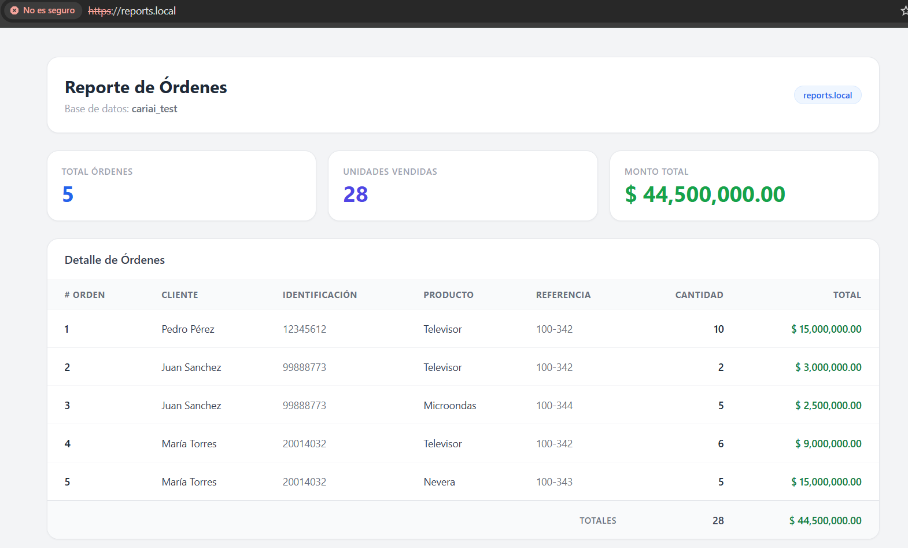
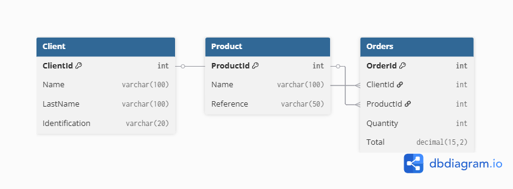

# Reports App

Aplicación de una sola página construida con **Laravel 12** y **PostgreSQL** que consulta la base de datos `cariai_test` y muestra un reporte de órdenes con sus clientes y productos asociados. No requiere login ni autenticación.

## Interfaz

La página principal muestra tres tarjetas de resumen (total de órdenes, unidades vendidas y monto total) seguidas de la tabla de detalle con todos los registros.



## Modelo de datos

Tres tablas relacionadas: `clients` y `products` como catálogos, y `orders` como tabla de hechos con llaves foráneas a ambas.



---

## Requisitos

- Docker y Docker Compose instalados.

---

## 1. Agregar el dominio local

**Linux / macOS:**
```bash
echo "127.0.0.1 reports.local" | sudo tee -a /etc/hosts
```

**Windows** — editar `C:\Windows\System32\drivers\etc\hosts` como administrador:
```
127.0.0.1 reports.local
```

---

## 2. Configurar variables de entorno

```bash
cd src
cp .env.example .env
```

---

## 3. Levantar los contenedores

```bash
docker compose up -d --build
```

---

## 4. Instalar dependencias y generar clave

```bash
docker compose exec app composer install
docker compose exec app php artisan key:generate
```

---

## 5. Migrar y cargar datos de prueba

```bash
docker compose exec app php artisan migrate --force
docker compose exec app php artisan db:seed
```

---

## 6. Abrir la aplicación

```
https://reports.local
```

> El navegador mostrará una advertencia por el certificado autofirmado. Acepta la excepción para continuar.

---

## Comandos útiles

```bash
# Ver logs
docker compose logs -f

# Detener contenedores
docker compose down

# Eliminar contenedores y volúmenes (borra BD y certificados)
docker compose down -v

# Shell del contenedor PHP
docker compose exec app sh
```
